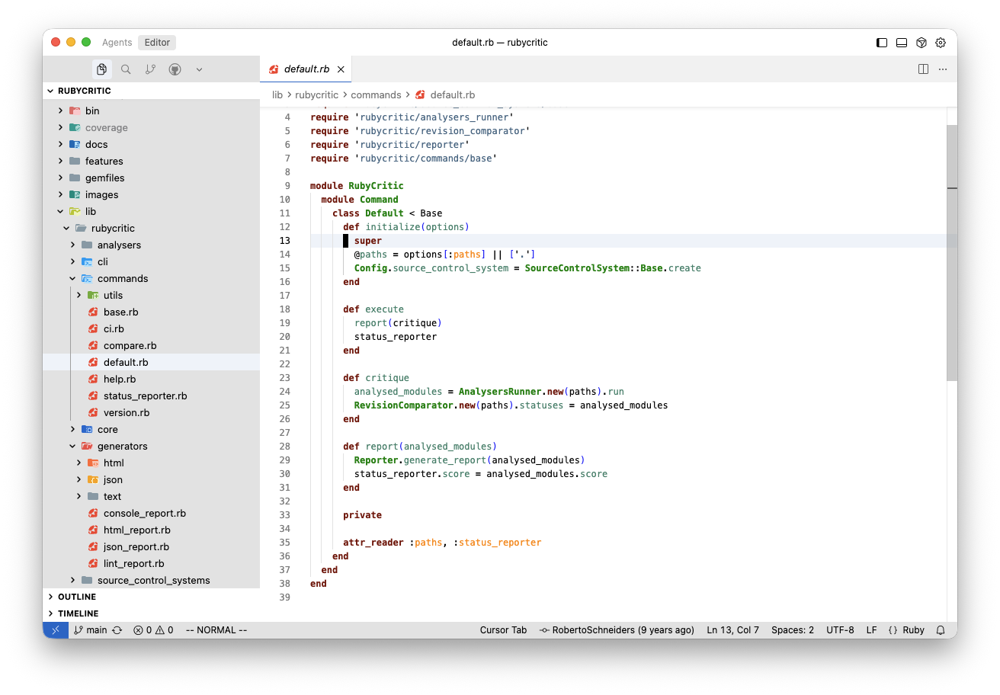

# MacVim Classic Theme

A VS Code theme inspired by MacVim's classic color scheme. This theme provides both dark and light versions with syntax highlighting that closely matches the MacVim editor.

This theme is based on the [`macvim.vim`](https://github.com/juanvqz/macvim-theme/blob/main/assets/macvim.vim) colorscheme used in the MacVim distribution, ensuring an authentic MacVim experience in VS Code.

## Features

- Dark and light theme variants
- Optimized for long coding sessions
- Syntax highlighting for popular programming languages
- MacVim-inspired color palette
- Easy on the eyes with good contrast

## Installation

1. Open VS Code
2. Go to Extensions (Cmd+Shift+X / Ctrl+Shift+X)
3. Search for "MacVim Classic"
4. Click Install

## Usage

After installation, select the theme:

1. Open Command Palette (Cmd+Shift+P / Ctrl+Shift+P)
2. Type "Preferences: Color Theme"
3. Select "MacVim Classic Dark" or "MacVim Classic Light"

Or go to: File > Preferences > Theme > Color Theme > MacVim Classic Dark / MacVim Classic Light

## Color Palette

Based on the original MacVim colorscheme:

### MacVim Classic Dark
- Background: `#1a1a1a` (Grey10)
- Foreground: `#808080` (Grey50)
- Comments: `#5f9ea0` (CadetBlue3, italic)
- Strings: `#4a708b` (SkyBlue4)
- Keywords/Statements: `#9b30ff` (Purple1, bold)
- Types: `#008b8b` (Cyan4, bold)
- Constants: `#ffc125` (Goldenrod1)
- Identifiers: `#458b74` (Aquamarine4)
- Functions: `#458b74` (Aquamarine4)
- Preprocessor: `#1874cd` (DodgerBlue3)
- Special: `#8a2be2` (BlueViolet)

### MacVim Classic Light
- Background: `#ffffff` (White)
- Foreground: `#000000` (Black)
- Comments: `#0000ee` (Blue2, italic)
- Strings: `#4a708b` (SkyBlue4)
- Keywords/Statements: `#800000` (Maroon, bold)
- Types: `#008b00` (Green4, bold)
- Constants: `#ff8c00` (DarkOrange)
- Identifiers: `#458b74` (Aquamarine4)
- Functions: `#458b74` (Aquamarine4)
- Preprocessor: `#1874cd` (DodgerBlue3)
- Special: `#8a2be2` (BlueViolet)

## Contributing

Contributions are welcome! Please feel free to submit a Pull Request.

## License

MIT License - see [LICENSE](LICENSE) file for details
