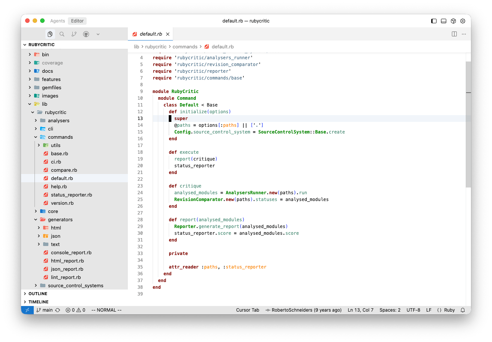
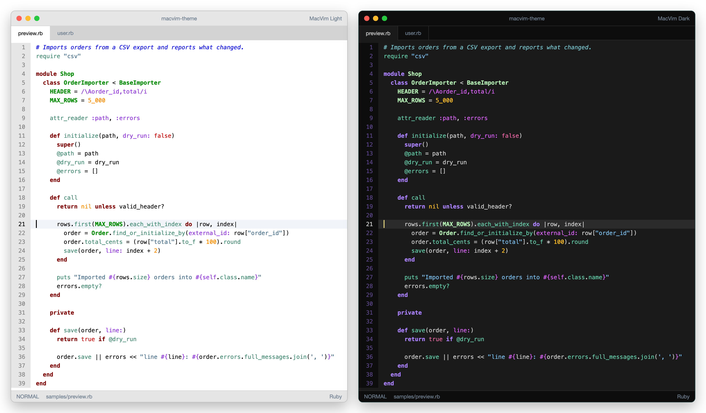

# MacVim Classic Theme

Ports of MacVim's default colorscheme ([`static/macvim.vim`](static/macvim.vim)) to other editors.



| Editor  | Folder               | Variants                     |
|---------|----------------------|------------------------------|
| VS Code | [`vscode/`](vscode/) | MacVim Classic Dark / Light  |
| Zed     | [`zed/`](zed/)       | MacVim Dark / Light          |

## VS Code

Install "MacVim Classic" from the VS Code Marketplace. Packaging and publishing run from the `vscode/` folder, see [`vscode/PUBLISHING.md`](vscode/PUBLISHING.md).

## Zed



The theme lives in [`zed/themes/macvim.json`](zed/themes/macvim.json). To use it locally, link it into Zed's themes folder:

```bash
mkdir -p ~/.config/zed/themes
ln -s "$PWD/zed/themes/macvim.json" ~/.config/zed/themes/macvim.json
```

Then pick "MacVim Light" or "MacVim Dark" from `theme selector: toggle`.

The JSON is generated. Edit the palette in [`scripts/zed/generate.rb`](scripts/zed/generate.rb) and run:

```bash
ruby scripts/zed/generate.rb
```

Then refresh the preview image (`static/zed.png`, rendered from the theme with headless Google Chrome):

```bash
ruby scripts/zed/preview.rb
```

- **MacVim Light** follows `macvim.vim` exactly (`background=light`).
- **MacVim Dark** keeps the same hue families as the original dark variant, but uses brighter X11 shades so text is readable (the original uses Grey50 text, SkyBlue4 strings and DeepPink4 booleans on Grey10).

| Group      | Original dark               | MacVim Dark (Zed)           |
|------------|-----------------------------|-----------------------------|
| Normal     | `#7f7f7f` Grey50            | `#cccccc` Grey80            |
| Comment    | `#7ac5cd` CadetBlue3        | `#7ac5cd` CadetBlue3        |
| String     | `#4a708b` SkyBlue4          | `#7ec0ee` SkyBlue2          |
| Statement  | `#9b30ff` Purple1           | `#ab82ff` MediumPurple1     |
| Type       | `#008b8b` Cyan4             | `#b4eeb4` DarkSeaGreen2     |
| Constant   | `#ffc125` Goldenrod1        | `#ffc125` Goldenrod1        |
| Boolean    | `#8b0a50` DeepPink4         | `#ee6aa7` HotPink2          |
| Identifier | `#458b74` Aquamarine4       | `#66cdaa` Aquamarine3       |
| PreProc    | `#1874cd` DodgerBlue3       | `#1e90ff` DodgerBlue1       |
| Special    | `#8a2be2` BlueViolet        | `#e066ff` MediumOrchid1     |
| Visual     | `#72f7ff`                   | `#104e8b` DodgerBlue4       |

## License

MIT License, see [LICENSE](LICENSE).
